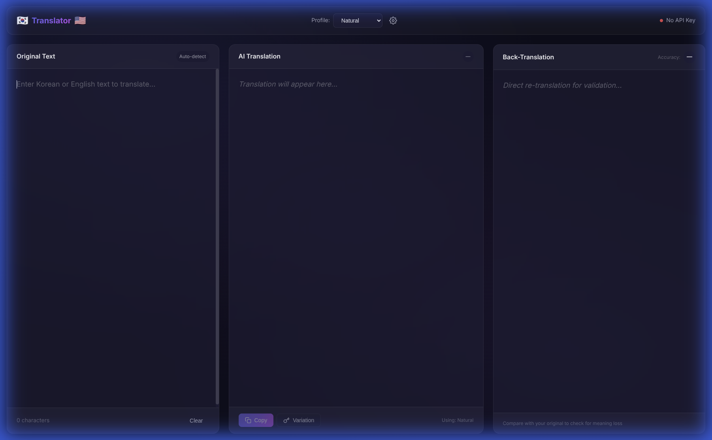

# Korean-English AI Translator

A cross-platform PWA for AI-powered Korean↔English translation with custom rules and profiles.



## Features

- 🔄 **Bidirectional Translation** - Auto-detects Korean/English and translates both ways
- 📝 **Three Translation Profiles**
  - **Natural** - Common phrases for natural-sounding translations
  - **Parent Talk** - Respectful informal Korean for family communication
  - **Direct** - Literal word-for-word translation
- ✅ **Accuracy Scoring** - AI-powered back-translation validation
- 🔍 **Word Alternatives** - Highlight text to see alternative translations
- 📋 **Quick Copy** - One-click copy to clipboard
- 🔄 **Variation Generation** - Generate different phrasings
- 👤 **Custom Profiles** - Create your own translation rules
- 📱 **PWA** - Install on Android and Linux desktop

## Quick Start (Local Development)

```bash
# Install dependencies
npm install

# Add your Gemini API key
cp .env.example .env
# Edit .env: GEMINI_API_KEY=your_key_here

# Start development server
npm run dev
```

## 🚀 Deploy to Render (Free)

### One-Click Deploy

[](https://render.com/deploy)

### Manual Deploy

1. **Push to GitHub**
   ```bash
   git init
   git add .
   git commit -m "Initial commit"
   git remote add origin YOUR_GITHUB_REPO_URL
   git push -u origin main
   ```

2. **Deploy on Render**
   - Go to [render.com](https://render.com) and sign up
   - Click "New +" → "Web Service"
   - Connect your GitHub repo
   - Render auto-detects settings from `render.yaml`
   - Add environment variable: `GEMINI_API_KEY` = your key
   - Add environment variable: `DEEPL_API_KEY` = your key (Get one [here](https://www.deepl.com/pro-api))
   - Click "Create Web Service"

3. **Access your app** at `https://your-app-name.onrender.com`

## Project Structure

```
korean-parent-translator/
├── src/                    # Frontend source
│   ├── index.html
│   ├── styles/main.css
│   └── js/
├── server/                 # Backend API
│   ├── index.js
│   └── services/
├── dist/                   # Production build (generated)
├── render.yaml             # Render deployment config
└── package.json
```

## Scripts

| Script | Description |
|--------|-------------|
| `npm run dev` | Start development server |
| `npm run build` | Build for production |
| `npm start` | Start production server |

## Tech Stack

- **Frontend**: Vanilla JS + Vite (PWA)
- **Backend**: Express.js
- **Translation Engine**: DeepL API
- **AI Features**: Google Gemini 1.5 Pro
- **Hosting**: Render (free tier)

## License

MIT
